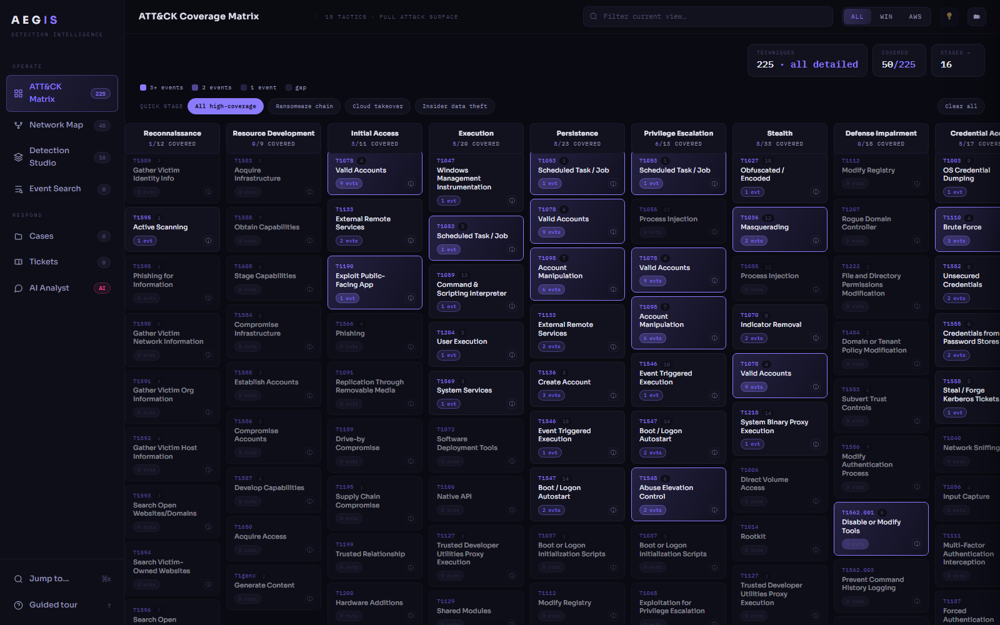
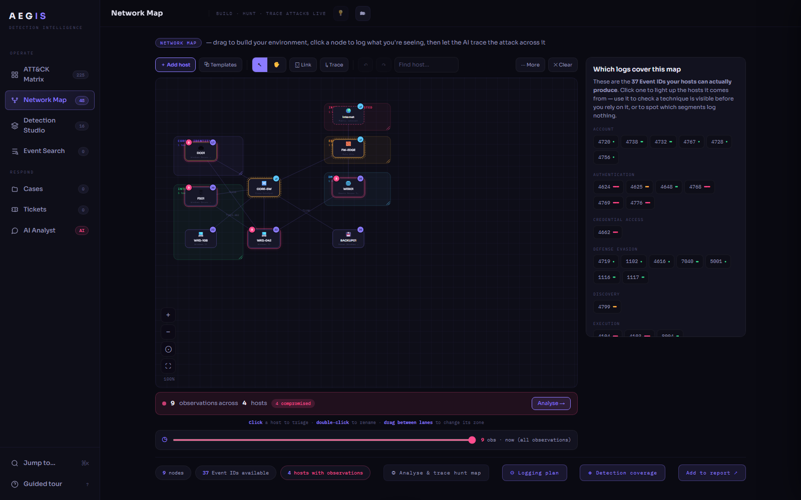
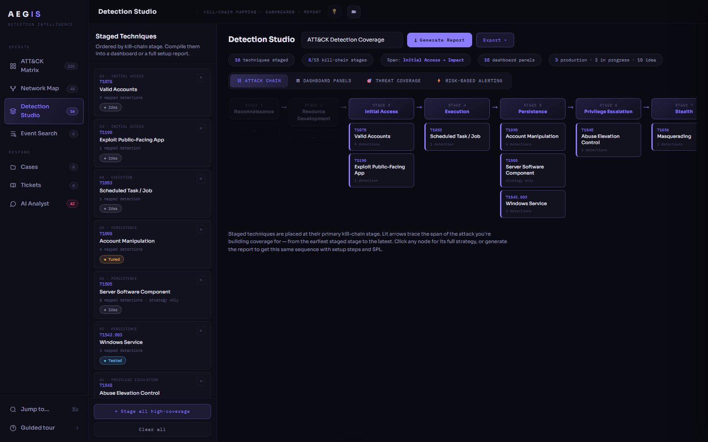

# AEGIS

[](https://github.com/the404treatment/Aegis/actions/workflows/test.yml)

SOC detection-engineering console with an incident-response platform.

**[Try it in the browser →](https://the404treatment.github.io/Aegis/)** — no install,
no signup, nothing to configure. The console is fully functional offline, so the
hosted build is the real app rather than a demo.

<p align="center">
  
</p>

<table>
  <tr>
    <td></td>
    <td></td>
  </tr>
  <tr>
    <td align="center"><sub>Hunt map — the intrusion traced across your estate</sub></td>
    <td align="center"><sub>Detection studio — staged techniques, mapped to the kill chain</sub></td>
  </tr>
</table>

## Run it on your own network

Install [Node.js 18+](https://nodejs.org), then:

**Windows** — double-click **`start.cmd`**
**Linux/macOS** — `./start.sh`

First run generates your tokens, builds the console, starts the server and opens
it. Nothing to `npm install` — AEGIS has no dependencies.

Then find the machines on your network and push the agent to them:

```bash
node discover.mjs --json targets.json                    # scan
node deploy-agents.mjs --targets targets.json            # review the plan
node deploy-agents.mjs --targets targets.json --confirm  # deploy
```

Telemetry starts arriving in the console immediately. Deployment is dry-run by
default, only touches hosts you list, and never handles your password — Windows
and ssh prompt for that themselves. **[Full step-by-step guide →](INSTALL.md)**

Runs fine on an isolated VM network or an air-gapped enclave: nothing is
downloaded at run time and nothing phones home.

```bash
npm run setup     # regenerate config + rebuild (keeps your tokens)
npm start         # start the server
npm test          # build + full suite (UI, server, end-to-end HTTP)
```

**Offline** (open `ui/index.html` directly, no backend): ATT&CK coverage
matrix, hunt map, detection studio, artifact triage, offline response
playbooks, IOC extraction, and in-browser ingest of Chainsaw / Suricata /
Zeek / PCAP exports.

**With the server:** live agent telemetry, event search, shared tickets,
case files with SHA-256 hashed evidence, signed formal reports, a
tamper-evident audit chain, and team chat. Named accounts with roles are
opt-in — without them the shared analyst token works exactly as before.

- `INSTALL.md` — step-by-step install: server, agents, firewall, verification
- `CLAUDE.md` — architecture, conventions, hard rules (read this first)
- `deploy/README-deploy.md` — server + agent deployment
- `splunk/aegis_hec_setup.md` — HEC config and starting searches
- `NEXT_STEPS.md` — priority-ordered roadmap

## Security posture

The agent is read-only by design: it reads event logs and reports host facts.
No command channel, no download path, no exec. Read `agents/aegis-agent.ps1`
before deploying it anywhere. The server binds `127.0.0.1` and has no TLS —
terminate TLS in front of it. See `CLAUDE.md` and `deploy/` for detail.
